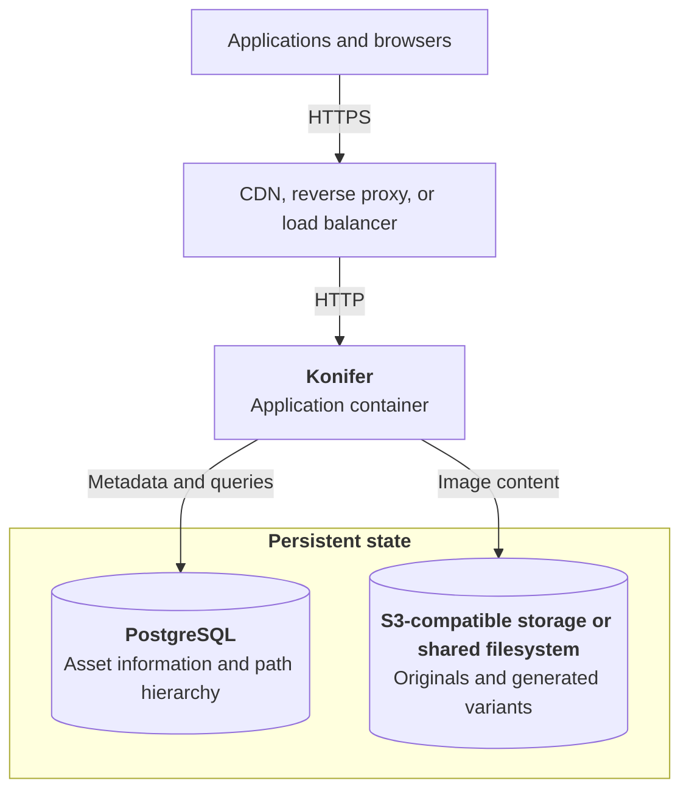

This guide takes Konifer from the in-memory quickstart to a persistent deployment. It is platform-neutral: the same
components can run with Docker, Docker Compose, Kubernetes, or another container orchestrator.

A production deployment has three main components. Konifer processes requests; PostgreSQL and image storage hold the
durable state:



Konifer itself is replaceable. PostgreSQL and the object store contain the state that must survive container replacement.

## Before you begin

You need:

- A container runtime or orchestrator
- PostgreSQL with permission to enable the `ltree` extension or the `ltree` extension already enabled
- An S3 or S3-compatible bucket, or a persistent filesystem mount
- A public URL for Konifer (if exposing over the public internet)
- A secure way to supply credentials and signing secrets

The repository includes a
[Docker Compose example](https://github.com/dmaiken/konifer/blob/main/docker-compose.yml) that starts Konifer,
PostgreSQL, and MinIO. It is useful for evaluating the persistent architecture, but its example credentials and exposed
database and MinIO ports are not a production configuration.

## 1. Prepare PostgreSQL

Create a database and application user according to your PostgreSQL provider's instructions. Enable `ltree` in the
database before starting Konifer:

```sql
CREATE EXTENSION IF NOT EXISTS ltree;
```

Konifer applies its bundled database migrations during startup. The application user therefore needs permission to
create and alter tables, indexes, and other schema objects in the application database, in addition to ordinary
read/write access.

Back up PostgreSQL as part of the deployment. Its records refer to content stored in the object store, so plan to
restore both stores to a compatible point in time.

## 2. Prepare content storage

### S3 or an S3-compatible service

Create every bucket referenced by your path configuration before starting Konifer. Konifer reads, writes, and deletes
objects, but it does not create S3 buckets.

Grant the service identity only the object permissions it needs for those buckets. When running against AWS, you can
omit static credentials and use the AWS default credential provider chain. Other S3-compatible services may require an
endpoint, access key, secret key, region, and path-style addressing.

### Filesystem storage

Filesystem storage is suitable when the content directory is mounted persistently into the container. Every Konifer
instance that serves the same PostgreSQL database must see the same files at the configured mount path.

For multiple replicas, shared object storage is usually the simpler model. See
[Storing assets and variants](../reference/asset-storage.md) for provider-specific configuration.

## 3. Create `konifer.conf`

Create a configuration file outside the container. The following example uses PostgreSQL and an S3-compatible object
store:

```hocon title="konifer.conf"
data-store {
  provider = postgresql

  postgresql {
    host = "postgres.internal"
    port = 5432
    database = "konifer"
    ssl-mode = "require"
  }
}

object-store {
  provider = s3

  s3 {
    endpoint-url = "https://s3.example.com"
    access-key = "konifer"
    region = "us-east-1"
    force-path-style = true
  }
}

http {
  public-url = "https://images.example.com"
}

paths {
  "/**" {
    object-store {
      bucket = "konifer-assets"
    }
  }
}
```

Set `http.public-url` to the externally visible origin. Konifer uses it when it creates asset links; it does not need to
match the internal container address.

`force-path-style` is required by some S3-compatible providers, including the MinIO configuration in the repository.
Omit the custom endpoint and static access key when your runtime supplies AWS credentials through its workload identity.

See the [Configuration reference](../reference/configuration-reference.md) for all available properties and defaults.

## 4. Supply secrets

Do not store passwords or signing keys in `konifer.conf`. Konifer supports environment-variable overrides for these
values:

```dotenv title="konifer.env"
PG_USER=konifer
PG_PASSWORD=replace-with-a-database-password
S3_SECRET_KEY=replace-with-an-object-store-secret
URL_SIGNING_SECRET_KEY=replace-with-a-signing-secret
```

Only provide `URL_SIGNING_SECRET_KEY` when URL signing is enabled. In an orchestrator, supply the same values through
its secret-management mechanism instead of committing an environment file.

## 5. Start the container

Mount the configuration file at `/app/config/konifer.conf`:

```bash
docker run --detach \
  --name konifer \
  --restart unless-stopped \
  --publish 127.0.0.1:8080:8080 \
  --env-file /secure/path/konifer.env \
  --mount type=bind,source=/etc/konifer/konifer.conf,target=/app/config/konifer.conf,readonly \
  ghcr.io/dmaiken/konifer:latest
```

Binding to `127.0.0.1` assumes that a reverse proxy on the same host accepts external traffic. Change the published
address to match your network design.

For reproducible deployments, use only released versions of Konifer. Konifer follows Semantic Versioning; see the
[Konifer release list](https://github.com/dmaiken/konifer/releases) for available versions.

```text
ghcr.io/dmaiken/konifer:<latest-release>
```

Konifer supports Linux `amd64` and `arm64` container images.

## 6. Check application health

The health endpoint returns `200 OK` after the application has started:

```bash
curl --fail 'http://127.0.0.1:8080/health'
```

```json
{"status":"okay"}
```

Use `/health` for container and load-balancer checks. It reports the Konifer application lifecycle; it is not a
continuous probe of PostgreSQL or object-storage health.

## 7. Expose Konifer safely

Terminate TLS at a reverse proxy, ingress, or load balancer. Configure its request-size and timeout limits to accommodate
the maximum uploads allowed by `source.multipart.max-bytes` and `source.url.max-bytes`.

Konifer does not replace your application's authentication or authorization layer. Keep store, update, delete, and rule
evaluation endpoints behind a trusted gateway or private network. If fetch URLs are public and accept arbitrary
transformations, enable [URL signing](../reference/url-signing.md) to prevent callers from modifying transformation
parameters or using your service for unapproved processing.

Decide deliberately which responses a CDN may cache. Konifer always supports ETags for content responses, while
`Cache-Control` behavior is configured by path. See [HTTP caching](../reference/http-caching.md).

## 8. Size processing resources

Image processing uses JVM heap, direct memory, native libvips memory, CPU, and temporary disk space. A container memory
limit must leave room for native processing in addition to the JVM.

Konifer writes temporary processing files under `/app/tmp`. The container's writable layer works initially, but a fast
temporary volume or appropriately sized `tmpfs` is preferable for sustained or high-volume workloads. Large images may
require disk-backed temporary storage rather than RAM.

Start with conservative request limits and variant-worker concurrency, then load-test with representative source images
and transformations. See [Image processing architecture](../reference/image-processing.md) for memory regions, temporary
storage, and worker configuration.

## 9. Add upload rules when needed

Normal image storage and transformation do not require model files. Upload Rules and the Rule Evaluation API use a
SigLIP2 model pack that must be downloaded separately and mounted at:

```text
/app/models/siglip2-base-patch16-224
```

Follow [Installing model files](../concepts/upload-rules.md#installing-model-files) before enabling either feature. Model
inference also changes the CPU and memory requirements of the deployment.

## Scaling to multiple instances

Konifer natively supports clustered deployment models. Before adding replicas, confirm that every instance uses:

- The same `konifer.conf` and secrets
- The same PostgreSQL database
- The same S3 buckets or shared filesystem
- The same model files when upload rules are enabled
- A load balancer that removes instances when `/health` fails

Configuration is loaded at startup, so roll all instances after changing path rules, profiles, storage settings, or URL
signing configuration.

## Backups and upgrades

Treat PostgreSQL and object storage as one application data set. Back up both, test restoration, and retain the
configuration used to interpret the restored data.

Konifer applies database migrations when it starts. For an upgrade:

1. Read the release notes and record the currently deployed image digest.
2. Back up PostgreSQL and the object store.
3. Start the new version with one instance and allow its migrations to finish.
4. Check `/health`, logs, uploads, original-image retrieval, and transformed-image retrieval.
5. Complete the rollout only after those checks pass.

Do not assume that rolling the container back also reverses a database migration. Confirm schema compatibility before
returning to an older image.

## Production checklist

Before accepting production traffic, verify that:

- `IN_MEMORY` is not enabled. If enabled, Konifer will emit warnings logs.
- PostgreSQL and object storage are persistent and backed up.
- The `ltree` extension is installed.
- Every configured S3 bucket exists.
- Secrets are supplied outside `konifer.conf` and are not committed to source control.
- `http.public-url` matches the public origin.
- TLS and access control are enforced by the surrounding platform.
- Public transformation URLs are signed when appropriate.
- Upload-size, CPU, memory, and temporary-storage limits have been tested.
- `/health`, container restarts, application logs, and dependency failures are monitored.
